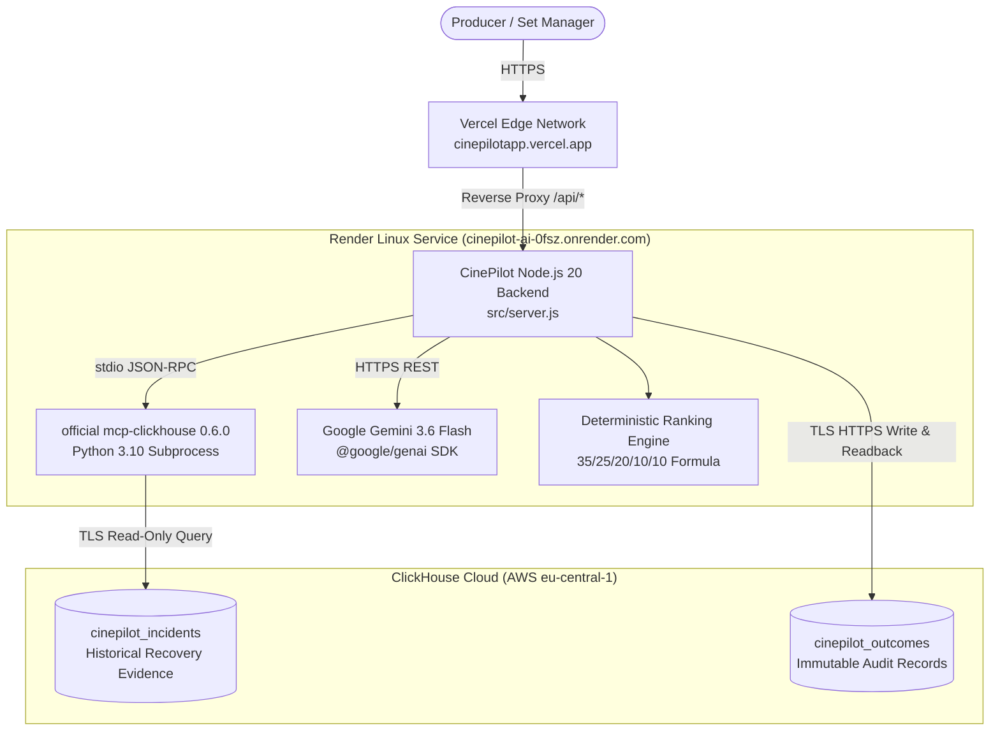

# CinePilot AI V3

Live Demo: [https://cinepilotapp.vercel.app](https://cinepilotapp.vercel.app)  
Backend API: [https://cinepilot-ai-0fsz.onrender.com](https://cinepilot-ai-0fsz.onrender.com)  
GitHub Repository: [https://github.com/judeik/cinepilot-ai](https://github.com/judeik/cinepilot-ai)  
License: MIT

---

## The Problem I Set Out to Solve

I built CinePilot because film production problems become very expensive when decisions have to be made in a rush.

On a set, disruptions happen without warning. A location permit gets revoked overnight. Weather washes out an exterior scene. An actor is only available until 6:00 PM before flying out. In Nigerian Nollywood and international film productions alike, a single stalled shoot day can easily cost millions of Naira (₦3,200,000 per delayed day in our benchmark scenario) while dozens of cast and crew members wait on standby.

When a disruption happens, the production manager or producer does not need panic or guesses. The real question is practical:

"What is our best recovery path based on what has actually worked in the past, what resources do we have on ground right now, and what will each choice cost us?"

CinePilot answers that question by pulling real historical incident evidence from ClickHouse Cloud, evaluating recovery trade-offs, calculating deterministic ranking scores, and waiting for explicit producer approval before updating production state.

---

## Why I Built It

As a software developer exploring how data systems can help creative industries, I wanted to see if software could turn messy production disruptions into clear, evidence-backed recovery decisions.

In most productions today, emergency rescheduling happens through hurried WhatsApp messages, memory, and gut feel. Sometimes that works. Often it leads to continuity mistakes, wasted crew hours, or blown budgets.

I wanted to build a system where historical operational memory is queried directly, candidate recovery plans are ranked against hard operational constraints, and the producer stays in control of the final call. CinePilot is the working prototype of that idea.

---

## How CinePilot Works

CinePilot follows a disciplined five-stage recovery loop:

1. **Incident Intake:** The system receives an operational disruption with its severity, affected scenes, exposed crew count, actor availability constraints, and daily delay cost.
2. **Evidence Retrieval via ClickHouse:** CinePilot launches the official ClickHouse MCP server (`mcp-clickhouse 0.6.0`) to query historical recovery analytics from ClickHouse Cloud.
3. **Multi-Factor Plan Ranking:** Candidate recovery plans are evaluated and scored using a deterministic formula across schedule preservation, budget impact, resource availability, creative continuity, and historical success.
4. **AI Reasoning Layer:** Google Gemini (`gemini-3.6-flash` via `@google/genai`) analyzes the evidence and recovery plans to provide structured rationale and risk analysis. If Gemini is temporarily unavailable, CinePilot gracefully falls back to deterministic ranking without breaking the workflow.
5. **Producer Approval Gate and Verification:** The system does not silently change the schedule. The producer must inspect the plans and authorize the recovery. Once approved, CinePilot updates the production state to `EXECUTED`, verifies the recovery to `RECOVERED`, writes the outcome record to ClickHouse Cloud over TLS, and reads it back immediately for audit confirmation.

---

## The Demo Scenario

To verify the system end-to-end, CinePilot uses a benchmark disruption scenario:

* **Production:** Echoes of Nsukka
* **Shoot Day:** 12
* **Incident Type:** `LOCATION_ACCESS_REVOKED`
* **Severity:** HIGH
* **Affected Scenes:** 42, 43, 44, 45 (Main compound exterior and veranda)
* **Crew Exposed:** 38 members
* **Lead Actor Availability:** Strictly until 18:00
* **Estimated Cost per Delayed Day:** ₦3,200,000

This represents a classic production emergency: 38 crew members are on payroll, daylight is burning, scenes 42 through 45 cannot shoot at the scheduled compound, and the lead actor cannot stay past 6:00 PM.

---

## The Recovery Decision and Deterministic Scoring

CinePilot formulates three candidate recovery plans and ranks them deterministically:

1. **`reorder` (Score: 92.78):** Resequence today's call sheet. Move forward interior scenes scheduled for Day 14 that can shoot in the nearby ancillary room. This keeps the crew working immediately and finishes the lead actor's scenes before 18:00.
2. **`split_unit` (Score: 83.46):** Split the crew into Unit A and Unit B. Send B-roll and second unit to shoot pick-ups while renegotiating location access for the main unit.
3. **`relocate` (Score: 74.68):** Pack gear and transport the entire 38-person crew to a backup compound. This introduces transport delays, fuel expenses, and risks missing the actor window.

### Scoring Formula
The score is not an AI confidence percentage. It is an operational index calculated from five weighted dimensions:

* **Schedule Impact (35%):** Protection of the critical path and actor departure window.
* **Budget Impact (25%):** Avoidance of delayed-day burn rates (₦3,200,000/day).
* **Resource Availability (20%):** Ready access to crew, gear, and alternative locations.
* **Creative Continuity (10%):** Lighting consistency and scene sequence logic.
* **Historical Success (10%):** Historical recovery success rate retrieved from ClickHouse Cloud.

`reorder` earned the top score of **92.78** because it protected the 18:00 actor cutoff without incurring transport overhead or splitting crew management.

---

## ClickHouse Cloud and Official MCP Integration

ClickHouse Cloud acts as CinePilot's operational memory. The hackathon track requires active runtime usage of the official ClickHouse MCP server, and that is exactly how CinePilot is built:

```
CinePilot Node.js Runtime
        │
        ▼ child_process.spawn()
official mcp-clickhouse 0.6.0 (stdio JSON-RPC 2.0)
        │
        ▼ TLS (port 8443)
ClickHouse Cloud (cinepilot_incidents table)
```

### Live Historical Evidence
During live verification, CinePilot queries historical recovery performance:

```sql
SELECT strategy,
       count() AS incidents,
       round(avg(days_saved), 2) AS avg_days_saved,
       round(avg(success_rate), 2) AS success_rate
FROM cinepilot_incidents
WHERE incident_type = 'LOCATION_ACCESS_REVOKED'
GROUP BY strategy
ORDER BY success_rate DESC
```

The live query returned three historical records:
* **`reorder`:** 12 incidents, 2.4 average days saved, **88.0%** historical success rate
* **`split_unit`:** 9 incidents, 2.7 average days saved, **81.0%** historical success rate
* **`relocate`:** 7 incidents, 1.8 average days saved, **73.0%** historical success rate

This evidence directly influences the deterministic ranking. CinePilot does not guess or use hardcoded demo numbers.

### Outcome Persistence and Audit Readback
Once the producer approves a recovery plan, CinePilot writes an immutable audit record to `cinepilot_outcomes` in ClickHouse Cloud and immediately executes a readback query to confirm the record exists.

---

## Google Gemini Integration and Runtime Resilience

Google Gemini is integrated using the official `@google/genai` SDK (`gemini-3.6-flash`). Its job is to provide natural language trade-off analysis and risk summaries over the ClickHouse evidence.

Here is an honest technical detail about the verified deployment:

During the final production end-to-end verification, the upstream Google AI Studio endpoint returned a temporary `503 UNAVAILABLE` error (*"This model is currently experiencing high demand. Spikes in demand are usually temporary. Please try again later."*).

Rather than letting the entire application crash or showing a blank error screen on set, CinePilot's resilient architecture caught the upstream 503 error, engaged its deterministic fallback reasoning mode, and completed the full recovery lifecycle:

* Approval gate: Maintained
* Execution: Completed (`status: "EXECUTED"`)
* Verification: Confirmed (`status: "RECOVERED"`, `verified: true`)
* ClickHouse outcome persistence: Recorded
* ClickHouse audit readback: Confirmed

This resilience property is critical for mission-critical production software: an AI provider outage should never prevent a producer from making an informed operational decision.

---

## Producer Approval Gate

CinePilot enforces human authority. Autonomous schedule adjustments can cause contract disputes, safety issues, and crew fatigue.

The workflow strictly enforces:
```
Disruption Detected
        ↓
ClickHouse Evidence Gathered
        ↓
Plans Ranked Deterministically
        ↓
AI Risk Rationale Formulated
        ↓
[ PRODUCER APPROVAL GATE ]  <-- Hard stop: execution blocked until approval
        ↓
State Updated: EXECUTED
        ↓
Integrity Verified: RECOVERED
        ↓
Outcome Persisted to ClickHouse
```

Before approval, `run.approved` is `false` and `run.executed` is `false`. Only when the producer sends `POST /api/runs/:id/approve` does state transition to `EXECUTED` and verify to `RECOVERED`.

---

## System Architecture



---

## Why Vercel + Render

I chose a decoupled deployment architecture tailored to the hackathon requirements:

* **Vercel (`cinepilotapp.vercel.app`):** Hosts the static Producer Command Center on a global edge CDN. It uses `vercel.json` rewrites to proxy all `/api/*`, `/health`, and `/ready` requests directly to the backend, eliminating cross-origin browser issues.
* **Render (`cinepilot-ai-0fsz.onrender.com`):** Hosts the dual-runtime Linux container (`node:20-slim` + `python3` + `mcp-clickhouse==0.6.0`) required for the MCP stdio subprocess.
* **Cold-Start Warm-Up:** Because Render free-tier instances sleep after inactivity, the frontend implements bounded exponential backoff (`0s, 2s, 4s, 8s, 15s`) with a clear status indicator (*"CinePilot is starting its production intelligence engine..."*). The page never crashes or appears broken during a cold start.

---

## What Has Been Verified

Every component of CinePilot V3 has been verified live:

| Component | Target / Endpoint | Result |
|---|---|---|
| **Public Frontend** | `https://cinepilotapp.vercel.app` | **PASS** (HTTP 200) |
| **Backend Service** | `https://cinepilot-ai-0fsz.onrender.com` | **PASS** (HTTP 200) |
| **Liveness Check** | `GET /health` | **PASS** (HTTP 200, `<5ms`) |
| **Readiness Check** | `GET /ready` | **PASS** (HTTP 200, `status: "ready"`) |
| **Official MCP Server** | `mcp-clickhouse==0.6.0` | **PASS** (Subprocess handshake and query execution) |
| **ClickHouse Evidence** | `cinepilot_incidents` | **PASS** (3 rows returned over TLS) |
| **Deterministic Ranking** | `reorder`: 92.78, `split`: 83.46, `relocate`: 74.68 | **PASS** (Verified calculation) |
| **Approval Gate** | `POST /api/runs/:id/approve` | **PASS** (Enforced prior to execution) |
| **Execution State** | `status: "EXECUTED"` | **PASS** (Transition verified) |
| **Recovery State** | `status: "RECOVERED"`, `verified: true` | **PASS** (Schedule integrity verified) |
| **Outcome Persistence** | ClickHouse `cinepilot_outcomes` | **PASS** (Record written over HTTPS) |
| **Audit Readback** | `GET /api/outcomes/:id` | **PASS** (Immediate query confirmation) |
| **Unit and Core Tests** | `node --test tests/core.test.js` | **PASS** (15/15 tests passing) |
| **Syntax Validation** | `npm run check` | **PASS** (6/6 modules clean) |

---

## Technical Stack

Only technologies actually in this repository are listed:

* **Backend Runtime:** Node.js (>= 20.11.0, ES Modules)
* **AI SDK:** `@google/genai` (^2.21.0) with model `gemini-3.6-flash`
* **MCP Integration:** Official `mcp-clickhouse` 0.6.0 (Python 3.10+ stdio subprocess)
* **Database:** ClickHouse Cloud (Native TLS on port 8443)
* **Containerization:** Docker (`Dockerfile` dual-runtime base `node:20-slim`)
* **Frontend Hosting:** Vercel (Production domain: `cinepilotapp.vercel.app`)
* **Backend Hosting:** Render (Production service: `cinepilot-ai-0fsz.onrender.com`)
* **Frontend UI:** Vanilla HTML5, CSS3 custom properties, ES2022 JavaScript (zero bundle dependencies)
* **Test Framework:** Node.js native test runner (`node:test`, `node:assert/strict`)

---

## Security Practices

* **No Secrets in Source Control:** `.env` and local credentials are protected in `.gitignore`, `.dockerignore`, and `.vercelignore`.
* **Server-Side Credentials:** Gemini API keys and ClickHouse passwords exist solely as server-side environment variables on Render. No secret is ever exposed to client bundles or browser network tabs.
* **Read-Only MCP Access:** The MCP subprocess runs with `CLICKHOUSE_ALLOW_WRITE_ACCESS=false`, preventing unintended schema or data modifications.
* **Strict TLS:** ClickHouse Cloud connections enforce encrypted TLS (`CLICKHOUSE_SECURE=true`) and certificate verification (`CLICKHOUSE_VERIFY=true`).
* **Clean Docker Image:** Python virtual environments, local Windows binaries, and build artifacts are excluded from the production image.

---

## Local Development Setup

### Prerequisites
* Node.js >= 20.11.0
* Python >= 3.10 with `pip`
* ClickHouse Cloud instance (or local ClickHouse server)

### 1. Clone the Repository
```bash
git clone https://github.com/judeik/cinepilot-ai.git
cd cinepilot-ai
```

### 2. Install Node Dependencies
```bash
npm install
```

### 3. Install Python MCP Dependencies
```bash
pip install -r requirements.txt
```

### 4. Configure Environment Variables
Copy `.env.example` to `.env` and fill in your credentials:
```bash
cp .env.example .env
```

Key variables:
```ini
NODE_ENV=development
PORT=8056
HOST=0.0.0.0

# ClickHouse Cloud
CLICKHOUSE_HOST=your-clickhouse-host.clickhouse.cloud
CLICKHOUSE_PORT=8443
CLICKHOUSE_USER=default
CLICKHOUSE_PASSWORD=your-clickhouse-password
CLICKHOUSE_DATABASE=default
CLICKHOUSE_SECURE=true
CLICKHOUSE_VERIFY=true
CLICKHOUSE_MCP_COMMAND=mcp-clickhouse
CLICKHOUSE_ALLOW_WRITE_ACCESS=false
CINEPILOT_REQUIRE_LIVE_MCP=true

# Google Gemini
GEMINI_MODEL=gemini-3.6-flash
GEMINI_API_KEY=your-gemini-api-key
```

### 5. Run Verification Checks and Tests
```bash
# Verify syntax across all modules
npm run check

# Run core domain, ranking, and integration tests
npm test
```

### 6. Start the Command Center
```bash
npm start
```
Open [http://localhost:8056](http://localhost:8056) in your browser.

---

## Live Demo Walkthrough

Try the live system at [https://cinepilotapp.vercel.app](https://cinepilotapp.vercel.app):

1. **Check Status:** Notice the Runtime status indicator. If the Render backend is waking up, the warm-up banner will count down smoothly until the service reports ready.
2. **Review the Incident:** Look at the benchmark scenario cards for *Echoes of Nsukka* (Shoot Day 12, scenes 42 through 45 affected, ₦3,200,000 daily delay cost).
3. **Run Recovery:** Click **Run Recovery**. Watch the live event log show ClickHouse historical evidence retrieval via the official MCP server.
4. **Inspect Plans:** Review the three ranked recovery options (`reorder`, `split_unit`, `relocate`) and their dimensional score breakdowns.
5. **Authorize Recovery:** Review the recommended plan and click **Approve & Execute**.
6. **Confirm Audit:** Watch the state transition to `EXECUTED` and verify to `RECOVERED`. Scroll down to the **Recovery History & Audit Evidence** table to see your newly verified outcome persisted in ClickHouse Cloud.

---

## Why ClickHouse Matters to CinePilot

Film productions generate decades of operational data across call sheets, production reports, vendor invoices, and wrap logs, but this data almost always sits locked away in PDFs or forgotten spreadsheets.

ClickHouse is central to CinePilot because analytical aggregations over incident categories, delay costs, and strategy success rates need to happen fast enough to feed real-time operational decisions. By connecting ClickHouse Cloud through the official ClickHouse MCP server, CinePilot shows how analytical databases can serve as operational memory for live decision-support workflows.

---

## What I Want to Build Next

CinePilot V3 proves the core recovery loop. Here is where I want to take the product:

* **Richer Production History:** Expand the ClickHouse dataset to cover more incident categories, such as camera gear failures, cast illness, weather washouts, and generator breakdowns.
* **Direct Script Breakdown Imports:** Ingest standard Final Draft and PDF call sheets directly into scene and resource objects.
* **Multi-Unit Synchronization:** Support parallel tracking across main unit, second unit, and stunts.
* **Producer Financial Forecasting:** Deepen the budget impact model to calculate overtime pay penalties and union turnaround restrictions.
* **Provider-Independent AI Fallback:** Further harden the reasoning layer with multiple fallback tiers so that upstream AI capacity spikes never interrupt physical production.

---

## Founder Closing

I built CinePilot as an experiment in making high-stakes production decisions more evidence-based and less stressful. The current version proves that ClickHouse historical evidence, deterministic constraint scoring, AI reasoning, and human approval can work together in a real operational loop.

My next step is to test this workflow against actual production archives and build tools that fit seamlessly into how production teams already operate on set.

Thank you for reviewing CinePilot AI.

Jude Ojobor  
Creator of CinePilot AI  
GitHub: [@judeik](https://github.com/judeik)
