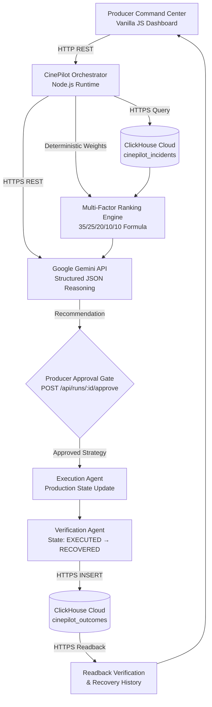

# CinePilot AI V3 — Production Recovery Intelligence Command Center

[](https://nodejs.org/)
[](https://ai.google.dev/)
[](https://clickhouse.com/)
[](tests/core.test.js)

> **CinePilot AI V3** is an AI-powered production recovery intelligence command center for film and television that converts real production disruption evidence into verified, auditable recovery decisions.

---

## Executive Summary

When an unforeseen disruption strikes a high-stakes film set — such as an abrupt location permit revocation or an expiring lead actor window — production managers face intense pressure to reschedule immediately. In television and feature film production, delay costs escalate rapidly (e.g. **₦3,200,000 / day** in our golden path scenario), while manual scheduling guesses often compromise creative continuity, breach actor availability windows, or balloon unit budgets.

CinePilot AI solves this by coordinating specialized agents that query historical recovery analytics from **ClickHouse Cloud over HTTPS**, deterministically rank candidate recovery plans against multi-factor operational constraints, prompt **Google Gemini (2.5 Flash)** to reason over trade-offs, enforce an explicit **Producer Approval Gate**, execute schedule transitions, verify recovery integrity, and persist auditable outcome records back to ClickHouse Cloud.

```text
Disruptive Incident
        │
        ▼
Evidence Retrieval (ClickHouse Cloud HTTPS)
        │
        ▼
Impact Assessment & Candidate Strategy Generation
        │
        ▼
Deterministic Plan Ranking (35/25/20/10/10 Formula)
        │
        ▼
AI Reasoning & Recommendation (Google Gemini API)
        │
        ▼
Producer Approval Gate (Explicit Authorization)
        │
        ▼
Recovery Execution & State Verification (RECOVERED)
        │
        ▼
ClickHouse Outcome Writeback & Readback Audit
```

---

## System Architecture

CinePilot uses a secure, lightweight direct HTTPS architecture:



---

## Why ClickHouse Cloud?

Film and media production intelligence requires fast column-oriented analytical aggregations across past incident archives, multi-unit splits, and shooting histories. ClickHouse Cloud acts as CinePilot's operational memory and audit ledger via direct HTTPS communication.

### 1. Historical Recovery Analytics (`cinepilot_incidents`)
Before formulating recovery plans, CinePilot queries historical strategy performance across similar incident types:
```sql
SELECT strategy,
       count() AS incidents,
       round(avg(days_saved), 2) AS avg_days_saved,
       round(avg(success_rate), 2) AS success_rate
FROM cinepilot_incidents
WHERE incident_type = 'LOCATION_ACCESS_REVOKED'
GROUP BY strategy
ORDER BY success_rate DESC
```
Live ClickHouse Cloud historical baseline:
* **`reorder`**: 12 incidents, 2.4 avg days saved, **88.0%** historical success
* **`split_unit`**: 9 incidents, 2.7 avg days saved, **81.0%** historical success
* **`relocate`**: 7 incidents, 1.8 avg days saved, **73.0%** historical success

### 2. Recovery Outcome Persistence & Audit Readback (`cinepilot_outcomes`)
Once a recovery plan is executed and verified, CinePilot writes a cryptographically linked outcome record directly to ClickHouse Cloud and confirms it via immediate readback verification:
* `run_id`: Unique execution identifier (UUID)
* `scenario_id`: Target production scenario identifier
* `strategy`: Selected recovery strategy (`reorder`, `split_unit`, `relocate`)
* `verified`: Binary verification flag (`1` or `0`)
* `status`: Recovery state (`RECOVERED` or `REVIEW_REQUIRED`)
* `recorded_at`: Timestamp of resolution (`DateTime`)

---

## Deterministic Ranking + Gemini Reasoning Layer

CinePilot couples mathematical determinism with generative reasoning to ensure safety, predictability, and deep operational insight:

### 1. Deterministic Decision Layer (Multi-Factor Scoring)
Candidate strategies are scored using a weighted multi-factor objective function:
$$\text{Score} = 0.35 \times \text{Schedule} + 0.25 \times \text{Budget} + 0.20 \times \text{Resources} + 0.10 \times \text{Continuity} + 0.10 \times \text{Historical}$$

* **Schedule Impact (35%)**: Days saved normalized against schedule risk.
* **Budget Impact (25%)**: Net cost savings relative to daily delay exposure.
* **Resource Availability (20%)**: Crew, gear, and facility readiness.
* **Creative Continuity (10%)**: Narrative and visual consistency retention.
* **Historical Success (10%)**: Empirically measured ClickHouse recovery rate.

### 2. Gemini Reasoning Layer (`gemini-2.5-flash`)
Google Gemini analyzes the concrete scenario, operational constraints (e.g. actor availability cutoff at 18:00), and historical ClickHouse evidence to synthesize a structured JSON decision:
* **`summary`**: Clear synthesis of the incident and critical dependencies.
* **`recommendation`**: Bounded candidate strategy identifier (e.g., `"reorder"`).
* **`risks`**: Key trade-offs and operational friction points.
* **`expected_outcome`**: Measurable recovery timeline and budget impact.

### 3. Human Control: Producer Approval Gate
CinePilot never executes autonomously without human oversight. The system transitions to an **Awaiting Approval** state. Execution only proceeds when the producer submits an explicit confirmation (`POST /api/runs/:runId/approve`).

---

## Component Responsibilities

| Component | Role & Responsibility |
| :--- | :--- |
| **Orchestrator** | Coordinates the recovery lifecycle, runs agents, and maintains timeline events. |
| **Evidence Layer** | Executes sanitized read-only analytical queries to ClickHouse Cloud over HTTPS. |
| **Impact Agent** | Evaluates schedule, budget, crew, and talent exposure risks. |
| **Recovery Engine** | Generates candidate action plans and applies deterministic scoring. |
| **Gemini Reasoner** | Performs structured LLM reasoning over production constraints and evidence. |
| **Producer Approval Gate** | Enforces human authorization before executing any operational changes. |
| **Execution Agent** | Updates internal production schedules and marks state as `EXECUTED`. |
| **Verification Agent** | Validates applied actions and confirms resolution status as `RECOVERED`. |
| **Audit Persistence** | Writes and verifies the outcome record in ClickHouse Cloud via HTTPS. |

---

## Golden Path: *Echoes of Nsukka*

The verified production scenario demonstrates recovery during an active shoot disruption:

* **Production**: *Echoes of Nsukka* (`golden-path-location-001`)
* **Incident**: `LOCATION_ACCESS_REVOKED` (Severity: `HIGH`)
* **Affected Scenes**: 42, 43, 44, 45 (Interior and courtyard blocks)
* **Crew Exposed**: 38 members
* **Lead Actor Availability**: Critical window expiring at **18:00**
* **Estimated Delay Cost**: **₦3,200,000 / day**

### Verified Outcome & Scores
1. **`reorder` (Score: 92.78)** — Protects the 18:00 actor window by sequencing critical scenes first without incurring high relocation costs.
2. **`split_unit` (Score: 83.46)** — Parallelizes work by splitting crews, but introduces coordination overhead.
3. **`relocate` (Score: 74.68)** — Moves to a backup location but incurs transition costs and continuity friction.

**Result**: Gemini recommends `reorder` $\rightarrow$ Producer approves $\rightarrow$ Execution completed $\rightarrow$ Verified (`RECOVERED`) $\rightarrow$ Outcome persisted to ClickHouse Cloud.

---

## Technology Stack

* **Runtime**: Node.js $\ge 20.11.0$ (ES modules, native test runner `node:test`)
* **AI Engine**: Google Gemini API (`gemini-2.5-flash` direct HTTPS REST)
* **Analytics & Database**: ClickHouse Cloud (Native HTTPS endpoint, JSONEachRow format, MergeTree engine)
* **Frontend**: Vanilla HTML5 / CSS3 / JavaScript Command Center (Zero build-step dashboard)
* **Testing**: Node.js built-in test runner (`node --test`) & syntax checks (`node --check`)
* **Deployment**: Docker, Docker Compose, Google Cloud Run configuration (`gcp/cloud-run.yaml`, `gcp/deploy.sh`)

---

## Quick Start

### 1. Clone & Install
```bash
git clone https://github.com/judeik/cinepilot-ai.git
cd cinepilot-ai
npm install
```

### 2. Start Development Server
```bash
npm run dev
```
Open **http://localhost:8056** in your browser. The application includes deterministic local fallback fixtures so the complete Golden Path workflow can be explored without external API keys.

---

## Environment Configuration

To enable live Google Gemini reasoning and direct ClickHouse Cloud analytics, copy `.env.example` to `.env`:

```bash
cp .env.example .env
```

Configure the following variables in `.env`:

| Variable | Description | Default | Required For |
| :--- | :--- | :--- | :--- |
| `PORT` | Local web server listening port | `8056` | Core server |
| `HOST` | Server bind host address | `0.0.0.0` | Core server |
| `GEMINI_API_KEY` | Google Gemini API Key | `""` | Live Gemini reasoning |
| `GEMINI_MODEL` | Gemini Model identifier | `gemini-2.5-flash` | Live Gemini reasoning |
| `CLICKHOUSE_HOST` | ClickHouse Cloud Hostname | `localhost` | Live ClickHouse analytics |
| `CLICKHOUSE_PORT` | ClickHouse HTTPS Port | `8443` | Live ClickHouse analytics |
| `CLICKHOUSE_USER` | ClickHouse Username | `default` | Live ClickHouse analytics |
| `CLICKHOUSE_PASSWORD` | ClickHouse Password | `""` | Live ClickHouse analytics |
| `CLICKHOUSE_DATABASE` | ClickHouse Database Name | `default` | Live ClickHouse analytics |
| `CLICKHOUSE_SECURE` | Enforce TLS / HTTPS | `true` | Live ClickHouse analytics |
| `API_TOKEN` | Optional `X-CinePilot-Token` auth | `""` | API protection |

---

## Demonstration Walkthrough

1. Open **http://localhost:8056**.
2. Click **Load Golden Path** to load *Echoes of Nsukka* (`LOCATION_ACCESS_REVOKED`).
3. Click **Run Recovery** to trigger the agent workflow:
   * Evidence Agent fetches multi-strategy recovery statistics from ClickHouse Cloud.
   * Recovery Engine scores candidates deterministically.
   * Gemini analyzes the 18:00 actor window and recommends `reorder`.
4. Inspect the ranked recovery cards and detailed score breakdowns.
5. Click **Approve & Execute** to simulate producer authorization.
6. Observe the live audit timeline:
   * State transitions to `EXECUTED`.
   * Verification confirms `RECOVERED`.
   * ClickHouse writes the outcome record and performs readback confirmation.
7. Review the **Recovery History & Audit Evidence** table at the bottom of the dashboard to view persisted ClickHouse records.

---

## Testing & Validation

CinePilot includes automated unit and integration tests using Node.js's native test runner:

```bash
# Run syntax and static module checks
npm run check

# Run full test suite (15 unit & integration tests)
npm test

# Check code formatting and whitespace
git diff --check
```

**Verified Test Suite Coverage**:
* Golden path scenario validation
* Deterministic multi-factor plan ranking
* SQL query safety assertion (restricting to `SELECT`/`WITH`)
* Gemini decision schema parsing and strategy normalization
* Gemini upstream network resilience and deterministic fallback
* ClickHouse outcome writeback payload validation
* Controlled outcome persistence and readback verification
* Outcome history retrieval and single-record lookup

---

## Security & Reliability

* **No Secrets Committed**: `.env` is strictly gitignored; `.env.example` contains placeholders only.
* **Strict SQL Query Guardrails**: Analytical queries are asserted to begin with `SELECT` or `WITH`; all destructive keywords (`DROP`, `DELETE`, `TRUNCATE`, `ALTER`) and stacked queries are strictly rejected.
* **Controlled Writeback**: Outcome writes are restricted exclusively to `INSERT INTO cinepilot_outcomes` with sanitized inputs.
* **Gemini Decision Schema Assertion**: LLM responses are parsed and validated against strict types before being accepted by the orchestrator.
* **Fail-Safe Fallbacks**: If ClickHouse Cloud or Gemini API encounters temporary upstream latency, CinePilot falls back gracefully to deterministic logic without crashing.

---

## Project Structure

```text
cinepilot-ai/
├── data/
│   └── location-access-revoked.json   # Golden Path scenario payload
├── gcp/
│   ├── cloud-run.yaml                 # Google Cloud Run deployment manifest
│   └── deploy.sh                      # Cloud Run deployment script
├── public/
│   └── index.html                     # Production Command Center UI
├── scripts/
│   ├── build.js                       # Lightweight build verification
│   └── clickhouse-init.sql            # ClickHouse schema initialization script
├── src/
│   ├── agents.js                      # Specialist agents, execution & verification
│   ├── config.js                      # Environment configuration parser
│   ├── domain.js                      # Scenario validation & deterministic ranking
│   ├── gemini.js                      # Google Gemini reasoning integration
│   ├── mcp.js                         # Direct ClickHouse Cloud HTTPS client
│   ├── server.js                      # REST API server & static file handler
│   └── store.js                       # In-memory execution state store
├── tests/
│   └── core.test.js                   # Complete 15-test test suite
├── .env.example                       # Environment configuration template
├── .gitignore                         # Git ignore rules
├── Dockerfile                         # Production container definition
├── docker-compose.yml                 # Local container orchestration
├── LICENSE                            # MIT License
├── package.json                       # Project manifest
└── README.md                          # Repository documentation
```

---

## License

This project is licensed under the MIT License — see the [LICENSE](LICENSE) file for details.
