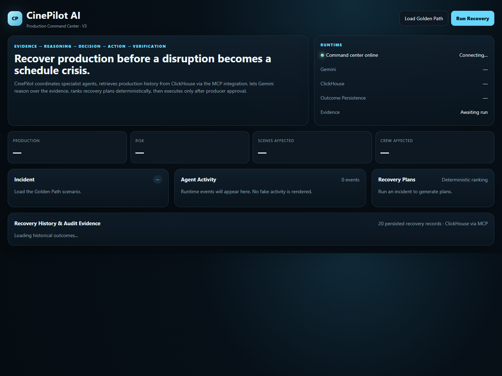
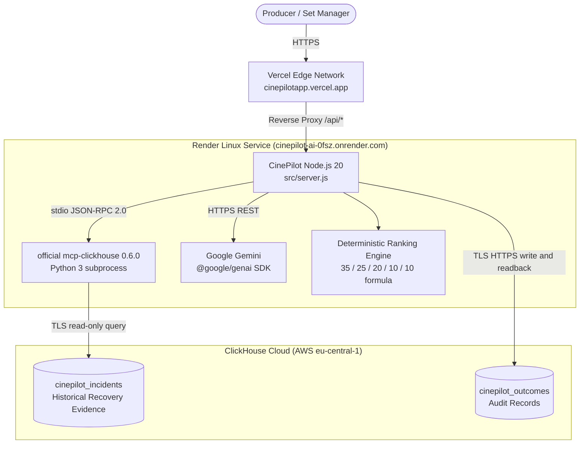

# CinePilot AI V3

**Live Demo:** [https://cinepilotapp.vercel.app](https://cinepilotapp.vercel.app)
**Backend API:** [https://cinepilot-ai-0fsz.onrender.com](https://cinepilot-ai-0fsz.onrender.com)
**GitHub:** [https://github.com/judeik/cinepilot-ai](https://github.com/judeik/cinepilot-ai)
**License:** MIT

---



---

## The Problem

Film productions lose real money when disruptions happen and no one can make a fast, informed decision.

A location permit gets revoked the night before a shoot. An actor's availability window closes at 6:00 PM. Weather cancels an exterior sequence. These things happen on every production, and when they do, the people who need to respond quickly often have the least information to work with.

The usual response is a chain of phone calls, WhatsApp messages, and gut-feel decisions made under pressure. Sometimes that works. When it does not, you end up with 38 crew members on standby burning budget, continuity problems that show up in the edit suite weeks later, and a production manager who had no good tool to help them think through the options.

The question I kept coming back to was not "what went wrong?" It was this:

> "Given what has worked before, what resources are available right now, and what each option will cost, what is the most defensible recovery path?"

That is what CinePilot tries to answer.

---

## Why I Built It

I am a software developer, not a film producer. But I have worked with people in creative industries who deal with exactly the kind of operational complexity described above.

I wanted to see if software could turn a production disruption into a structured, evidence-backed decision without requiring a data analyst in the room. Specifically, I wanted to know whether historical operational records, when queried at the right moment and combined with constraint scoring, could actually change how a producer evaluates their options.

CinePilot is the working prototype of that idea. It is not a commercial product. It is a demonstration of the workflow, built to prove that the core loop is technically achievable: retrieve historical evidence at runtime, score recovery candidates against hard constraints, wait for a human to approve, execute, verify, and record the outcome.

---

## How CinePilot Works

When a production disruption comes in, CinePilot does the following:

**First**, it reads the incident: what went wrong, which scenes are affected, how many crew members are exposed, what the actor availability window is, and what each delayed day costs.

**Then**, it queries ClickHouse Cloud through the official ClickHouse MCP server to retrieve historical recovery performance for that incident type. This gives it actual numbers: how often each recovery strategy has worked before, and how many days of production each strategy has typically saved.

**Next**, it scores the available recovery options. The scoring is deterministic. Five weighted dimensions (schedule impact, budget impact, resource availability, creative continuity, and historical success) produce a composite index for each candidate plan. The plan with the highest index is the recommendation.

**Alongside this**, Google Gemini provides natural language trade-off analysis over the evidence. When Gemini is available, it adds structured rationale to each option. When it is not, CinePilot continues with the deterministic ranking and does not fail.

**Then it stops and waits.** Nothing executes automatically. The producer reviews the ranked plans, sees the evidence behind each one, and approves a specific strategy. Only after that approval does CinePilot transition the production state, verify the recovery, and write the audit record to ClickHouse.

The full cycle is: **incident → evidence → ranking → approval → execution → verification → ClickHouse persistence.**

---

## The Demo Scenario

CinePilot uses a benchmark scenario to demonstrate the complete workflow end-to-end:

| Field | Value |
|---|---|
| Production | Echoes of Nsukka |
| Shoot Day | 12 |
| Incident | `LOCATION_ACCESS_REVOKED` |
| Severity | HIGH |
| Affected Scenes | 42, 43, 44, 45 (main compound exterior and veranda) |
| Crew Exposed | 38 members |
| Lead Actor Window | Strictly until 18:00 |
| Estimated Daily Delay Cost | ₦3,200,000 |

This is a fictional production scenario, not a real commercial film. I chose it because it captures multiple simultaneous constraints that make recovery genuinely difficult: 38 crew members are on payroll, daylight is running out, four key scenes cannot shoot at the scheduled location, and the lead actor has a hard departure at 6:00 PM.

---

## The Recovery Decision

CinePilot evaluated three candidate recovery strategies for the scenario above:

1. **`reorder` (Score: 92.78)**
   Resequence today's call sheet. Move interior scenes scheduled for Day 14 into the ancillary room that is available now. The crew keeps working immediately, and the lead actor's scenes finish before 18:00.

2. **`split_unit` (Score: 83.46)**
   Split the crew. Send a second unit to shoot pick-ups and B-roll while renegotiating access to the main compound. Keeps momentum but introduces coordination complexity.

3. **`relocate` (Score: 74.68)**
   Transport the full 38-person crew to a backup compound. Adds fuel costs, loading time, and real risk of missing the actor's 18:00 window.

### What the Score Actually Means

These scores are not accuracy percentages. They are operational indices calculated from five weighted dimensions:

| Dimension | Weight |
|---|---|
| Schedule Impact | 35% |
| Budget Impact | 25% |
| Resource Availability | 20% |
| Creative Continuity | 10% |
| Historical Success Rate | 10% |

`reorder` scored 92.78 because it protected the 18:00 actor cutoff, required no transport overhead, and had the strongest historical success rate in the ClickHouse evidence. That combination puts it well ahead of the other two options under these specific constraints.

---

## ClickHouse Integration

ClickHouse Cloud acts as CinePilot's operational memory. This is not a cosmetic integration: the historical evidence CinePilot retrieves at runtime directly feeds into the scoring formula.

The runtime path is:

```
CinePilot Node.js Backend
        |
        | child_process.spawn() -- stdio JSON-RPC 2.0
        v
official mcp-clickhouse 0.6.0 (Python subprocess)
        |
        | TLS on port 8443
        v
ClickHouse Cloud -- cinepilot_incidents table
```

During live verification, CinePilot ran the following query through the MCP server:

```sql
SELECT strategy,
       count() AS incidents,
       round(avg(days_saved), 2) AS avg_days_saved,
       round(avg(success_rate), 2) AS success_rate
FROM cinepilot_incidents
WHERE incident_type = 'LOCATION_ACCESS_REVOKED'
GROUP BY strategy
ORDER BY success_rate DESC
```

The query returned three records:

| Strategy | Incidents | Avg Days Saved | Historical Success |
|---|---|---|---|
| `reorder` | 12 | 2.4 | 88.0% |
| `split_unit` | 9 | 2.7 | 81.0% |
| `relocate` | 7 | 1.8 | 73.0% |

These are the numbers that informed the recovery ranking. CinePilot does not use hardcoded demo values.

### Outcome Persistence

After the producer approves and execution completes, CinePilot writes an audit record to `cinepilot_outcomes` in ClickHouse Cloud over HTTPS and immediately reads it back. The readback confirms the record exists before the workflow closes.

---

## Gemini Integration and Resilience

I integrated Google Gemini using the official `@google/genai` SDK (`gemini-3.6-flash`). Gemini's job in the workflow is to analyze the ClickHouse evidence and recovery plans and produce structured, natural language trade-off rationale that a producer can actually read.

Here is the honest account of what happened during the final production end-to-end verification:

The upstream Google AI Studio endpoint returned a temporary `503 UNAVAILABLE` response with the message: *"This model is currently experiencing high demand. Spikes in demand are usually temporary."*

CinePilot caught the error, engaged its deterministic fallback mode, and continued the workflow without interruption:

- Producer approval gate: maintained
- Execution: completed (`status: "EXECUTED"`)
- Verification: confirmed (`status: "RECOVERED"`, `verified: true`)
- ClickHouse outcome: written and read back successfully

The final production E2E run did not use live Gemini reasoning. It used the deterministic fallback. I am documenting this because the resilience behavior is intentional and the test result is real: CinePilot completed the full workflow correctly despite the upstream AI failure.

### Google Cloud and Vertex AI Support

CinePilot is built using the official `@google/genai` SDK and includes native support for two deployment configurations:

* **Google AI Studio / Gemini API:** Configured via `GEMINI_API_KEY` (and optional `GEMINI_MODEL=gemini-3.6-flash`). This is the active authentication path on the live Render deployment.
* **Google Cloud Vertex AI:** Configured by setting `GOOGLE_GENAI_USE_VERTEXAI=true`, `GOOGLE_CLOUD_PROJECT`, and `GOOGLE_CLOUD_LOCATION` (for example, `us-central1`). CinePilot initializes the SDK in Vertex AI mode with `vertexai: true`.

The codebase supports both authentication paths with identical schema validation and deterministic fallback safety.

---

## Producer Approval Gate

CinePilot does not execute recovery actions automatically.

The workflow has a hard stop before any production state changes:

```
Disruption Detected
        |
ClickHouse Evidence Gathered
        |
Plans Ranked Deterministically
        |
AI Risk Rationale Formulated (or deterministic fallback)
        |
[ PRODUCER APPROVAL REQUIRED ]   <-- Nothing executes until this happens
        |
State: EXECUTED
        |
Verification: RECOVERED
        |
Outcome Persisted to ClickHouse
```

Before the producer sends `POST /api/runs/:id/approve`, the run state holds `approved: false` and `executed: false`. The system will not advance past that point on its own. This is a deliberate design choice: automated schedule changes can cause contract disputes, union issues, and crew fatigue problems. The producer stays in control of the final call.

---

## System Architecture



---

## Why Vercel and Render

I chose this split deployment because the two runtimes have different requirements.

The frontend is a static HTML file with no build step. Vercel serves it from a global edge network and handles the proxy rewrites that route `/api/*`, `/health`, and `/ready` to the backend. This eliminates browser cross-origin issues without any extra configuration on the client side.

The backend needs to run a persistent Python subprocess for the MCP server alongside the Node.js process. Render's Docker runtime supports this cleanly. The production container runs `node:20-slim` with Python 3 and `mcp-clickhouse==0.6.0` installed side by side.

**One practical note about Render's free tier:** instances sleep after a period of inactivity. When the backend is cold, the frontend shows a clear status banner and retries with bounded exponential backoff (0s, 2s, 4s, 8s, 15s) until the service reports ready. The page stays functional and does not appear broken during a cold start.

---

## What Has Been Verified

| Component | Status |
|---|---|
| Public frontend (`cinepilotapp.vercel.app`) | PASS |
| Backend service (`cinepilot-ai-0fsz.onrender.com`) | PASS |
| `GET /health` | PASS |
| `GET /healthz` | PASS |
| `GET /ready` | PASS |
| official `mcp-clickhouse 0.6.0` subprocess handshake | PASS |
| Live ClickHouse evidence query (3 rows returned over TLS) | PASS |
| Deterministic ranking (`reorder`: 92.78, `split_unit`: 83.46, `relocate`: 74.68) | PASS |
| Producer approval gate enforced before execution | PASS |
| Execution state (`status: "EXECUTED"`) | PASS |
| Recovery verification (`status: "RECOVERED"`, `verified: true`) | PASS |
| ClickHouse outcome persistence (`cinepilot_outcomes`) | PASS |
| ClickHouse audit readback (`GET /api/outcomes/:id`) | PASS |
| `GET /api/outcomes` (recent outcomes list) | PASS |
| Unit and core tests (`node --test tests/core.test.js`) | PASS -- 15/15 |
| Syntax validation (`npm run check`) | PASS -- 6/6 modules |

---

## Technical Stack

These are the technologies actually in this repository:

| Technology | Role |
|---|---|
| Node.js >= 20.11.0 (ES Modules) | Backend runtime |
| `@google/genai` ^2.21.0 | Gemini SDK (`gemini-3.6-flash`) |
| `mcp-clickhouse` 0.6.0 (Python 3) | Official ClickHouse MCP server subprocess |
| ClickHouse Cloud (TLS, port 8443) | Operational evidence and audit storage |
| Docker (`node:20-slim` dual-runtime) | Container image for Render |
| Vercel | Frontend hosting and API proxy |
| Render | Backend and MCP subprocess hosting |
| Vanilla HTML5 / CSS3 / ES2022 JavaScript | Frontend (zero npm dependencies) |
| Node.js native test runner (`node:test`) | Test framework |

No other AI providers are used. OpenAI, Anthropic, LangChain, and similar libraries are not in the dependency tree.

---

## Security

- **No secrets in source control.** `.env`, local credentials, and Windows build artifacts are excluded via `.gitignore`, `.dockerignore`, and `.vercelignore`.
- **Server-side credentials only.** The Gemini API key and ClickHouse password exist solely as environment variables on Render. Nothing is exposed to the browser or included in the Vercel deployment.
- **Read-only MCP access.** The MCP subprocess runs with `CLICKHOUSE_ALLOW_WRITE_ACCESS=false`. Schema and data modifications through the MCP path are not possible.
- **Strict TLS.** ClickHouse Cloud connections enforce encrypted TLS (`CLICKHOUSE_SECURE=true`) with certificate verification (`CLICKHOUSE_VERIFY=true`).
- **Controlled write path.** Direct ClickHouse writes (outcome persistence) happen only through the Node.js backend over HTTPS, not through the MCP subprocess.

---

## Local Development

### Prerequisites

- Node.js >= 20.11.0
- Python >= 3.10 with `pip`
- A ClickHouse Cloud instance (or local ClickHouse server)
- A Google Gemini API key

### 1. Clone the Repository

```bash
git clone https://github.com/judeik/cinepilot-ai.git
cd cinepilot-ai
```

### 2. Install Node Dependencies

```bash
npm install
```

### 3. Install the MCP Server

```bash
pip install -r requirements.txt
```

This installs `mcp-clickhouse==0.6.0`.

### 4. Configure Environment Variables

```bash
cp .env.example .env
```

Fill in your credentials:

```ini
PORT=8056
HOST=0.0.0.0

# Google Gemini
GEMINI_API_KEY=your-gemini-api-key
GEMINI_MODEL=gemini-3.6-flash

# ClickHouse Cloud
CLICKHOUSE_HOST=your-host.clickhouse.cloud
CLICKHOUSE_PORT=8443
CLICKHOUSE_USER=default
CLICKHOUSE_PASSWORD=your-clickhouse-password
CLICKHOUSE_DATABASE=default
CLICKHOUSE_SECURE=true
CLICKHOUSE_VERIFY=true
CLICKHOUSE_MCP_COMMAND=mcp-clickhouse
CLICKHOUSE_ALLOW_WRITE_ACCESS=false
# Set to false for local development fallback; set to true for strict live MCP validation
CINEPILOT_REQUIRE_LIVE_MCP=false
```

### 5. Run Checks and Tests

```bash
# Syntax check all six modules
npm run check

# Run the core test suite (15 tests)
npm test
```

### 6. Start the Server

```bash
npm start
```

Open [http://localhost:8056](http://localhost:8056).

---

## Live Demo

The production system is available at [https://cinepilotapp.vercel.app](https://cinepilotapp.vercel.app).

What you will see:

1. **Status indicator** -- If the Render backend is waking from sleep, a warm-up banner will count down until the service is ready. This is expected behavior on the free tier.
2. **The scenario** -- The *Echoes of Nsukka* incident is pre-loaded: shoot day 12, scenes 42 to 45, 38 crew members exposed, ₦3,200,000 daily delay cost.
3. **Run Recovery** -- Click this to trigger the workflow. The event log will show ClickHouse evidence retrieval through the MCP server in real time.
4. **Recovery plans** -- Three ranked options appear with dimensional score breakdowns.
5. **Approve and Execute** -- Select a plan and approve it. The system transitions to `EXECUTED`.
6. **RECOVERED** -- Verification runs and confirms the recovery. The audit record appears in the Recovery History table, persisted in ClickHouse Cloud.

---

## Why ClickHouse

ClickHouse is not just the storage layer here. It is the evidence layer.

Film productions accumulate years of operational data: incident reports, strategy outcomes, delay costs, schedule recovery times. When that data is queryable at runtime through an analytical database, it can inform decisions in the moment rather than sitting unused in a spreadsheet somewhere.

By connecting ClickHouse Cloud through the official ClickHouse MCP server (`mcp-clickhouse==0.6.0`), CinePilot queries this evidence at the moment a recovery decision needs to be made. The three rows returned from `cinepilot_incidents` during live verification were not mocked values. They were the actual historical evidence that shaped the recovery ranking the producer saw on screen.

That is the connection I wanted to demonstrate for the ClickHouse hackathon track: an analytical database acting as live operational memory inside a real-time decision-support workflow.

---

## What I Want to Build Next

The current version proves the recovery loop works. There are several obvious directions from here:

**Richer production history.** The demo dataset covers `LOCATION_ACCESS_REVOKED` scenarios. Real productions encounter camera failures, cast illness, weather washouts, and generator breakdowns. Expanding the ClickHouse dataset to cover these categories would make the evidence layer genuinely useful.

**Call sheet imports.** Right now the scenario is a static JSON file. Being able to ingest a real Final Draft breakdown or PDF call sheet and extract scene, resource, and constraint data automatically would close a significant gap between the demo and a usable product.

**Multi-unit coordination.** Productions with a main unit, second unit, and stunt unit running in parallel create scheduling complexity that the current single-run model does not handle. Supporting parallel recovery tracks is a natural next step.

**Deeper budget modeling.** The current budget factor is directional. A more precise model would account for overtime penalties, union turnaround restrictions, and vendor cancellation clauses.

**Better Gemini integration.** When upstream model availability stabilises, I want the AI reasoning layer to do more: flag continuity risks, explain trade-offs in plain language, and give the producer a concise reason to prefer one option over another. The infrastructure is already in place.

---

## Founder Closing

I built CinePilot to test whether production recovery decisions could be made more evidence-based. The technical question was specific: can you connect a live analytical database to a real-time decision workflow, enforce human approval before any state changes, and record every outcome in a way that improves future decisions?

The answer, based on what CinePilot V3 demonstrates, is yes.

The current version is a working proof of concept. My next goal is to test it against real production archives, expand the scenario coverage, and build an interface that fits naturally into how production teams communicate on set -- rather than requiring them to adapt to a new tool.

Thank you for reviewing the project.

Jude Ojobor
Creator, CinePilot AI
GitHub: [@judeik](https://github.com/judeik)
